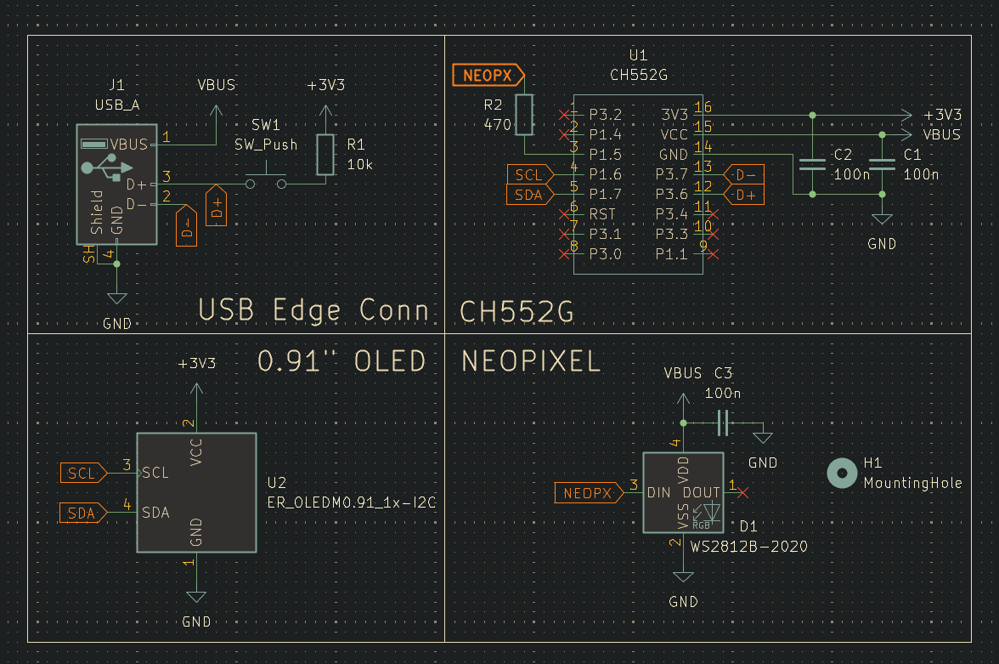
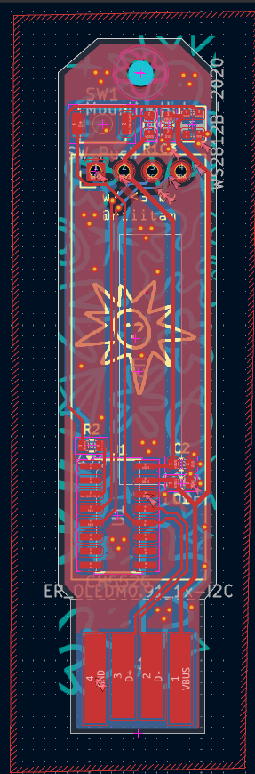
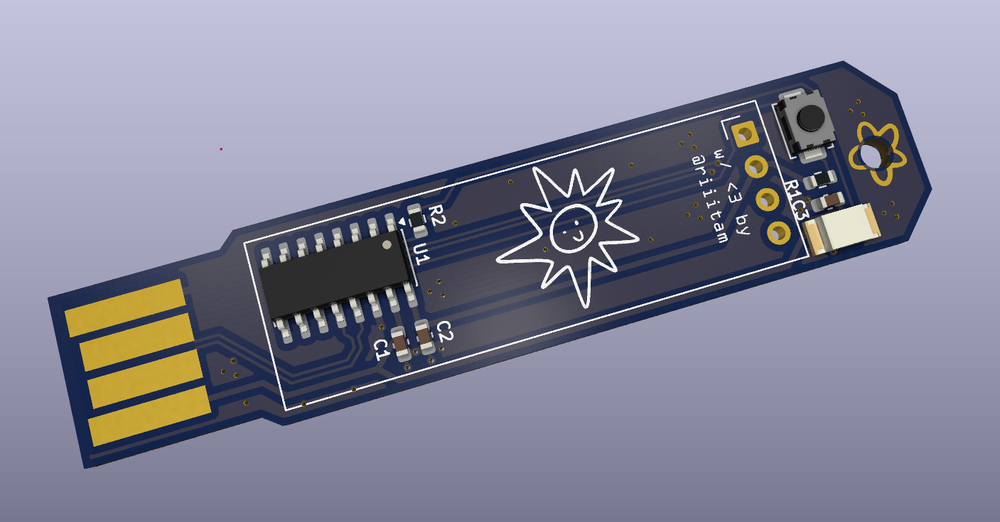
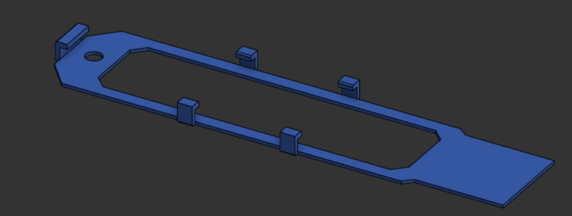
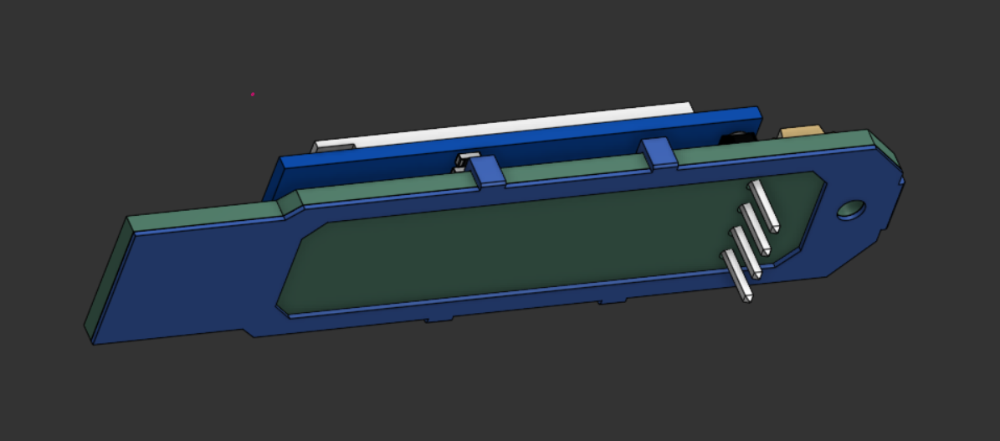
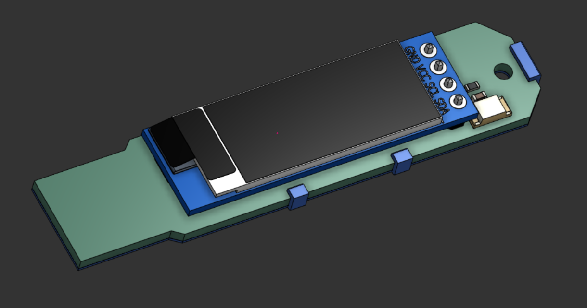
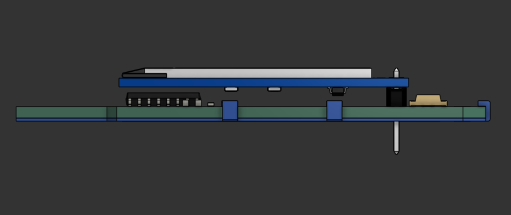

# usbuddy

A cute USB buddy. The PCB plugs straight into your laptop and can show messages based on serial input.
Powered by the `CH552G`, a generic `0.91" 128x32 SSD1305`, and a `WS2812B-2020` Neopixel.

## PCB

## CAD

### [OnShape Link](https://cad.onshape.com/documents/ad3ec215ff10d03571851e1e/w/97fc9671f557026641b18237/e/4b67f7499092e09124438d32)

## BOM

| Designator | Footprint                        | Quantity | Value               | LCSC Part # | Cost  |
| ---------- | -------------------------------- | -------- | ------------------- | ----------- | ----- |
| C1, C2, C3 | 0603                             | 3        | 100n                | C14663      | $0.04 |
| D1         | LED_WS2812B-2020_PLCC4_2.0x2.0mm | 1        | WS2812B-2020        | C965555     | $0.10 |
| J1         | USB-A                            | 1        | USB_A               |             |       |
| R1         | 0603                             | 1        | 10k                 | C25804      | $0.01 |
| R2         | 0603                             | 1        | 470                 | C23179      | $0.01 |
| SW1        | SW_SPST_TS-1088-xR020            | 1        | SW_Push             | C720477     | $0.05 |
| U1         | SOIC-16_3.9x9.9mm_P1.27mm        | 1        | CH552G              | C111292     | $0.74 |
| U2         | ER_OLEDM0.91_1x-I2C_NoCtyd       | 1        | ER_OLEDM0.91_1x-I2C |             | $1.20 |

**PCB Fabrication Cost:** $20.62

**PCBA (2) and Parts:** $15.43

**Total with shipping:** $45.74

or, with 5 assembled:

**PCBA (5) and Parts:** $18.03

**Total with shipping:** $48.72

**Discounts (not accounted in total)**

- -$2.00 JLCONE App
- -$20.00 Coupon
