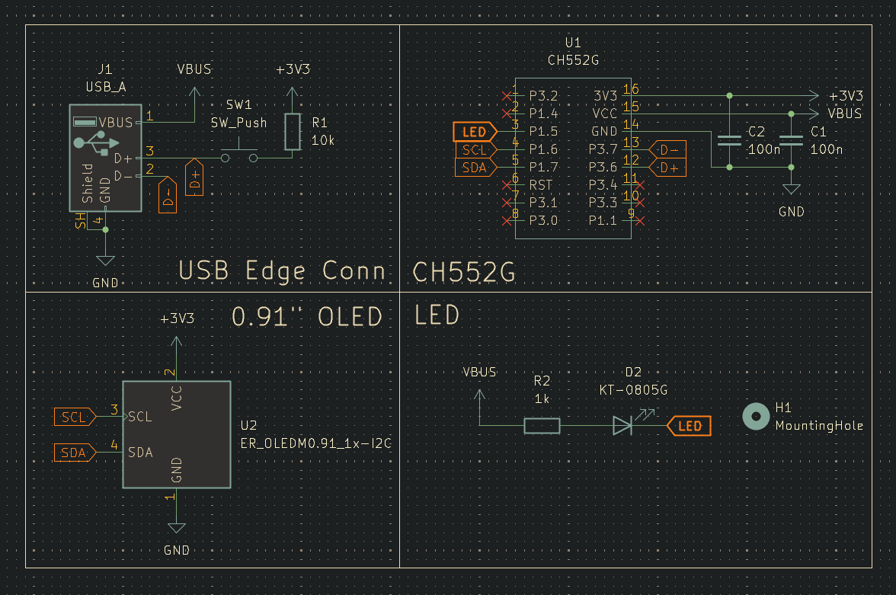
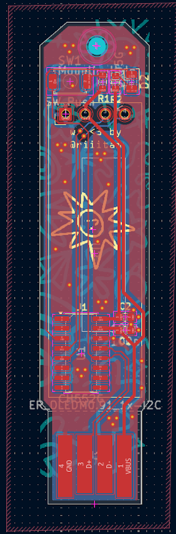
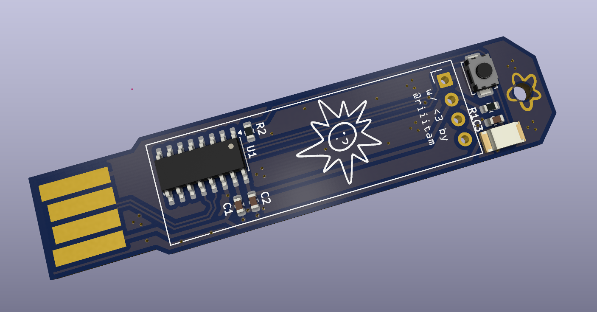
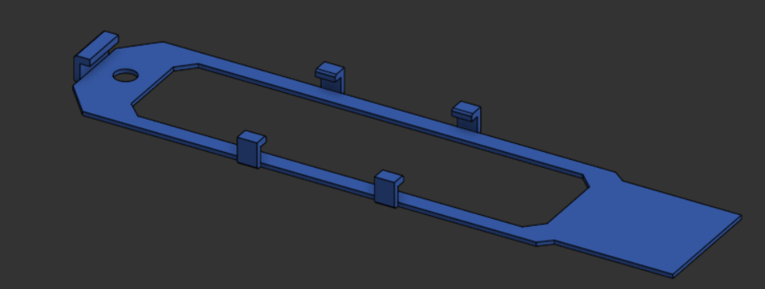
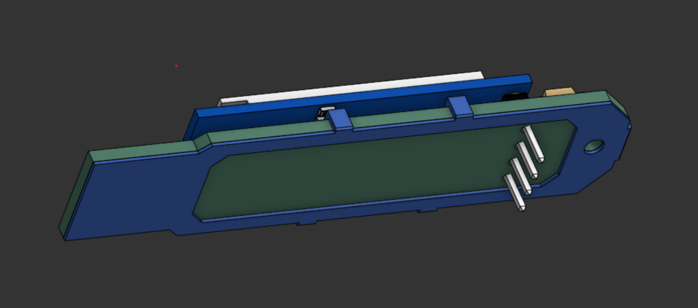
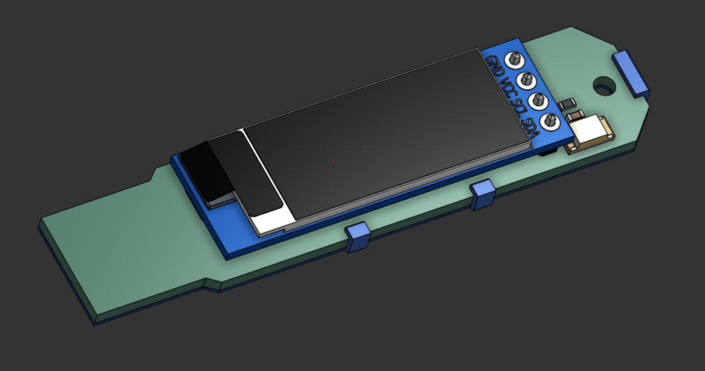
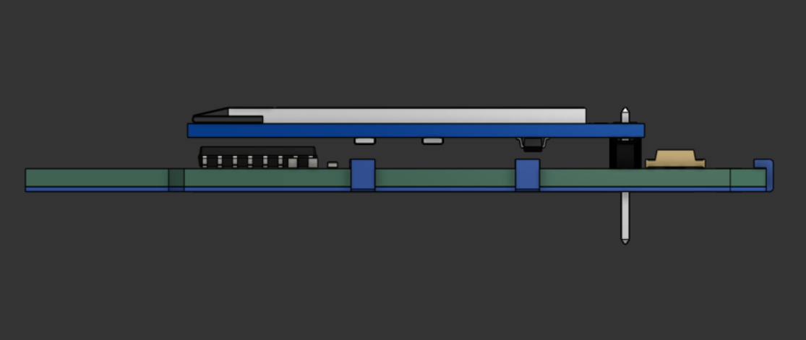

# usbuddy

A cute USB buddy. The PCB plugs straight into your laptop and can show messages based on serial input.
Powered by the `CH552G`, a generic `0.91" 128x32 SSD1305`, and a `WS2812B-2020` Neopixel.

## PCB

## CAD

### [OnShape Link](https://cad.onshape.com/documents/ad3ec215ff10d03571851e1e/w/97fc9671f557026641b18237/e/4b67f7499092e09124438d32)

## BOM

| Designator | Footprint                  | Quantity | Value               | LCSC Part # | Cost (1u) |
| ---------- | -------------------------- | -------- | ------------------- | ----------- | --------- |
| C1, C2     | 0603                       | 2        | 100n                | C14663      | $0.04     |
| D2         | 0805                       | 1        | KT-0805G            | C2297       | $0.02     |
| J1         | USB-A                      | 1        | USB_A               |             |           |
| R1         | 0603                       | 1        | 10k                 | C25804      | $0.01     |
| R2         | 0603                       | 1        | 1k                  | C21190      | $0.01     |
| SW1        | SW_SPST_TS-1088-xR020      | 1        | SW_Push             | C720477     | $0.05     |
| U1         | SOIC-16_3.9x9.9mm_P1.27mm  | 1        | CH552G              | C111292     | $0.74     |
| U2         | ER_OLEDM0.91_1x-I2C_NoCtyd | 1        | ER_OLEDM0.91_1x-I2C |             | $1.20     |

## Cost of Production

| Option                 | Qty | PCB Fabrication | PCBA & Parts | OLED + LED | Shipping |  **Total** |
| ---------------------- | --: | --------------: | -----------: | ---------: | -------: | ---------: |
| **5 assembled (ENIG)** |   5 |          $20.62 |       $18.03 |      $6.00 |    $9.92 | **$54.57** |
| **5 assembled (HASL)** |   5 |           $4.00 |       $18.03 |      $6.00 |    $9.92 | **$39.95** |

### Discounts (not accounted in total)

- -$2.00 JLCONE App
- -$9.00 PCBA Coupon
